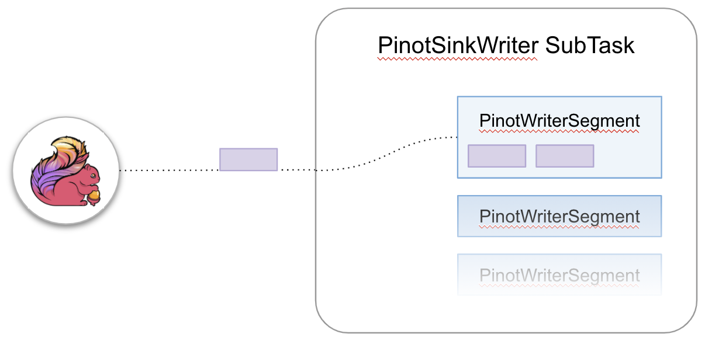

# Flink Pinot Connector

This connector provides a sink to [Apache Pinot](http://pinot.apache.org/)™.  
To use this connector, add the following dependency to your project:

    <dependency>
      <groupId>org.apache.bahir</groupId>
      <artifactId>flink-connector-pinot_2.11</artifactId>
      <version>1.1-SNAPSHOT</version>
    </dependency>

*Version Compatibility*: This module is compatible with Pinot 0.6.0.

Note that the streaming connectors are not part of the binary distribution of Flink. You need to link them into your job jar for cluster execution.
See how to link with them for cluster execution [here](https://ci.apache.org/projects/flink/flink-docs-release-1.2/dev/linking.html).

The sink class is called `PinotSink`.

## Usage
```java
StreamExecutionEnvironment env = ...
// Checkpointing needs to be enabled when executing in STREAMING mode
env.enableCheckpointing(long interval);

DataStream<PinotRow> dataStream = ...
PinotSink pinotSink = new PinotSink.Builder<PinotRow>(String pinotControllerHost, String pinotControllerPort, String tableName)
        
        // Serializes a PinotRow to JSON format
        .withJsonSerializer(JsonSerializer<PinotRow> jsonSerializer)
        
        // Extracts the timestamp from a PinotRow
        .withEventTimeExtractor(EventTimeExtractor<IN> eventTimeExtractor)
        
        // Defines the segment name generation via the predefined SimpleSegmentNameGenerator
        // Exemplary segment name: tableName_minTimestamp_maxTimestamp_segmentNamePostfix_0
        .withSimpleSegmentNameGenerator(String tableName, String segmentNamePostfix)
        
        // Use a custom segment name generator if the SimpleSegmentNameGenerator does not work for your use case
        .withSegmentNameGenerator(SegmentNameGenerator segmentNameGenerator)
        
        // Use the local filesystem to share committables across subTasks
        // CAUTION: Use only if all subTasks run on the same node with access to the local filesystem
        .withLocalFileSystemAdapter()
        
        // Use a custom filesystem adapter. 
        // CAUTION: Make sure all nodes your Flink app runs on can access the shared filesystem via the provided FileSystemAdapter
        .withFileSystemAdapter(FileSystemAdapter fsAdapter)
        
        // Defines the size of the Pinot segments
        .withMaxRowsPerSegment(int maxRowsPerSegment)
        
        // Prefix within the local filesystem's temp directory used for storing intermediate files
        .withTempDirectoryPrefix(String tempDirPrefix)
        
        // Builds the PinotSink
        .build()
dataStream.addSink(pinotSink);
```

## Architecture
The Pinot sink stores elements from upstream Flink tasks in an Apache Pinot table.
We support two execution modes
* `RuntimeExecutionMode.BATCH`
* `RuntimeExecutionMode.STREAMING` which requires checkpointing to be enabled.

### PinotSinkWriter
Whenever the sink receives elements from upstream tasks, they are received by an instance of the PinotSinkWriter.
The PinotSinkWriter will create 

{:width="300px"}
